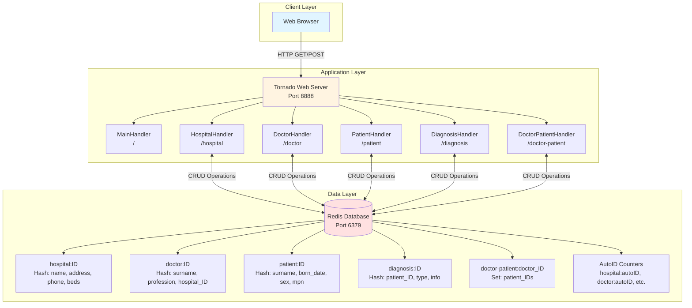
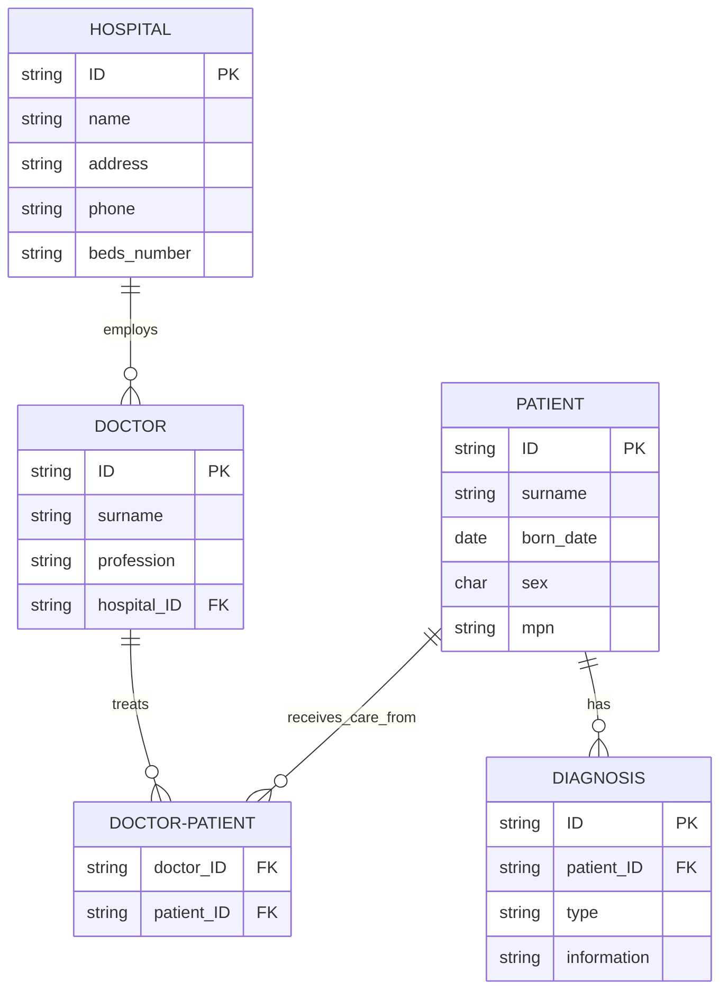
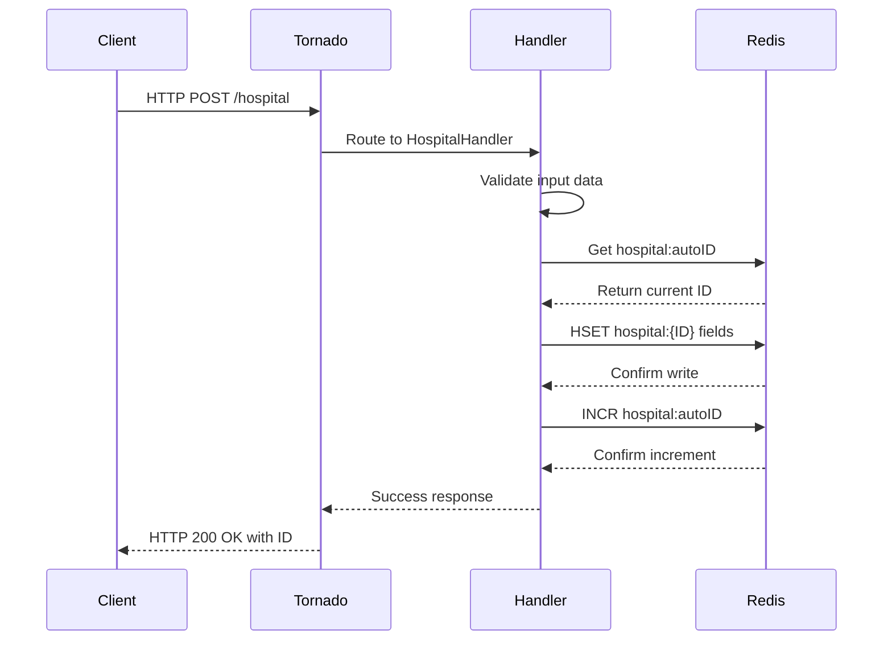

# Hospital Management System

A web-based hospital management application built with Python Tornado framework and Redis database. The system provides CRUD operations for managing hospitals, doctors, patients, diagnoses, and doctor-patient relationships.

## 📋 Table of Contents

- [Features](#features)
- [Technology Stack](#technology-stack)
- [Architecture](#architecture)
- [Installation](#installation)
- [Running the Application](#running-the-application)
- [API Documentation](#api-documentation)
- [Testing](#testing)
- [Load Testing](#load-testing)
- [Project Structure](#project-structure)

## ✨ Features

- **Hospital Management**: Create and view hospitals with detailed information
- **Doctor Management**: Register doctors and associate them with hospitals
- **Patient Management**: Register patients with medical policy numbers
- **Diagnosis Tracking**: Record diagnoses linked to patients
- **Doctor-Patient Relationships**: Manage many-to-many relationships between doctors and patients
- **RESTful API**: Clean HTTP endpoints for all operations
- **Responsive UI**: Bootstrap-based interface with smooth animations
- **Data Validation**: Server-side validation for all inputs
- **Redis Storage**: Fast, in-memory data storage with persistence

## 🛠 Technology Stack

- **Backend**: Python 3.8+ with Tornado 6.0.3
- **Database**: Redis 7
- **Frontend**: HTML5, Bootstrap 4.4.1, Animate.css
- **Testing**: pytest, pytest-tornado, fakeredis
- **Load Testing**: Locust
- **Package Management**: uv (modern Python package manager)
- **Containerization**: Docker & Docker Compose

## 🏗 Architecture

### System Architecture



### Data Model



### Request Flow



## 📦 Installation

### Prerequisites

- Python 3.8 or higher
- Docker and Docker Compose (optional, for containerized Redis)
- Git

### Option 1: Using uv (Recommended)

1. **Install uv**:
   ```bash
   # Linux/macOS
   curl -LsSf https://astral.sh/uv/install.sh | sh

   # Or via pip
   pip install uv
   ```

2. **Clone the repository**:
   ```bash
   git clone <repository-url>
   cd hw-6-vibe-code/python3-app
   ```

3. **Install dependencies**:
   ```bash
   uv sync
   ```

### Option 2: Using pip

1. **Clone the repository**:
   ```bash
   git clone <repository-url>
   cd hw-6-vibe-code/python3-app
   ```

2. **Create virtual environment**:
   ```bash
   python3 -m venv .venv
   source .venv/bin/activate  # On Windows: .venv\Scripts\activate
   ```

3. **Install dependencies**:
   ```bash
   pip install -r requirements.txt
   ```

## 🚀 Running the Application

### Step 1: Start Redis

**Option A: Using Docker Compose (Recommended)**
```bash
cd python3-app
docker-compose up -d
```

**Option B: Local Redis Installation**
```bash
# Ubuntu/Debian
sudo apt-get update
sudo apt-get install redis-server
sudo systemctl start redis-server

# macOS (Homebrew)
brew install redis
brew services start redis

# Verify Redis is running
redis-cli ping  # Should return: PONG
```

### Step 2: Configure Redis Connection (Optional)

If Redis is not running on `localhost:6379`, update the connection in `main.py` line 12:
```python
r = redis.StrictRedis(host="your-redis-host", port=6379, db=0)
```

Or use environment variables:
```bash
export REDIS_HOST=localhost
export REDIS_PORT=6379
```

### Step 3: Start the Application

**Using uv:**
```bash
uv run python main.py
```

**Using regular Python:**
```bash
python main.py
```

The application will be available at **http://localhost:8888**

### Step 4: Verify Installation

Open your browser and navigate to http://localhost:8888. You should see the main page with buttons to navigate to different sections.

## 📚 API Documentation

### Base URL
```
http://localhost:8888
```

### Endpoints

#### 1. Main Page
- **URL**: `/`
- **Method**: `GET`
- **Description**: Returns the main landing page with navigation
- **Response**: HTML page

---

#### 2. Hospital Management

##### Get All Hospitals
- **URL**: `/hospital`
- **Method**: `GET`
- **Description**: Retrieves a list of all hospitals
- **Response**: HTML page with hospital table

##### Create Hospital
- **URL**: `/hospital`
- **Method**: `POST`
- **Content-Type**: `application/x-www-form-urlencoded`
- **Parameters**:
  | Parameter | Type | Required | Description |
  |-----------|------|----------|-------------|
  | name | string | Yes | Hospital name |
  | address | string | Yes | Hospital address |
  | phone | string | No | Contact phone number |
  | beds_number | string | No | Number of beds |

- **Example Request**:
  ```bash
  curl -X POST http://localhost:8888/hospital \
    -d "name=City Hospital" \
    -d "address=123 Main Street" \
    -d "phone=+1-555-0123" \
    -d "beds_number=250"
  ```

- **Success Response**: `OK: ID 1 for City Hospital`
- **Error Responses**:
  - `400 Bad Request`: Missing required fields
  - `400 Bad Request`: Redis connection refused

---

#### 3. Doctor Management

##### Get All Doctors
- **URL**: `/doctor`
- **Method**: `GET`
- **Description**: Retrieves a list of all doctors
- **Response**: HTML page with doctor table

##### Create Doctor
- **URL**: `/doctor`
- **Method**: `POST`
- **Content-Type**: `application/x-www-form-urlencoded`
- **Parameters**:
  | Parameter | Type | Required | Description |
  |-----------|------|----------|-------------|
  | surname | string | Yes | Doctor's surname |
  | profession | string | Yes | Medical profession |
  | hospital_ID | string | No | ID of associated hospital |

- **Example Request**:
  ```bash
  curl -X POST http://localhost:8888/doctor \
    -d "surname=Smith" \
    -d "profession=Cardiologist" \
    -d "hospital_ID=0"
  ```

- **Success Response**: `OK: ID 1 for Smith`
- **Error Responses**:
  - `400 Bad Request`: Missing required fields
  - `400 Bad Request`: No hospital with such ID

---

#### 4. Patient Management

##### Get All Patients
- **URL**: `/patient`
- **Method**: `GET`
- **Description**: Retrieves a list of all patients
- **Response**: HTML page with patient table

##### Create Patient
- **URL**: `/patient`
- **Method**: `POST`
- **Content-Type**: `application/x-www-form-urlencoded`
- **Parameters**:
  | Parameter | Type | Required | Description |
  |-----------|------|----------|-------------|
  | surname | string | Yes | Patient's surname |
  | born_date | date | Yes | Date of birth (YYYY-MM-DD) |
  | sex | char | Yes | Sex ('M' or 'F') |
  | mpn | string | Yes | Medical policy number |

- **Example Request**:
  ```bash
  curl -X POST http://localhost:8888/patient \
    -d "surname=Doe" \
    -d "born_date=1990-01-01" \
    -d "sex=M" \
    -d "mpn=123456789"
  ```

- **Success Response**: `OK: ID 1 for Doe`
- **Error Responses**:
  - `400 Bad Request`: Missing required fields
  - `400 Bad Request`: Sex must be 'M' or 'F'

---

#### 5. Diagnosis Management

##### Get All Diagnoses
- **URL**: `/diagnosis`
- **Method**: `GET`
- **Description**: Retrieves a list of all diagnoses
- **Response**: HTML page with diagnosis table

##### Create Diagnosis
- **URL**: `/diagnosis`
- **Method**: `POST`
- **Content-Type**: `application/x-www-form-urlencoded`
- **Parameters**:
  | Parameter | Type | Required | Description |
  |-----------|------|----------|-------------|
  | patient_ID | string | Yes | ID of the patient |
  | type | string | Yes | Diagnosis type |
  | information | string | No | Additional information |

- **Example Request**:
  ```bash
  curl -X POST http://localhost:8888/diagnosis \
    -d "patient_ID=0" \
    -d "type=Influenza" \
    -d "information=Common flu symptoms"
  ```

- **Success Response**: `OK: ID 1 for patient Doe`
- **Error Responses**:
  - `400 Bad Request`: Missing required fields
  - `400 Bad Request`: No patient with such ID

---

#### 6. Doctor-Patient Relationships

##### Get All Relationships
- **URL**: `/doctor-patient`
- **Method**: `GET`
- **Description**: Retrieves all doctor-patient relationships
- **Response**: HTML page with relationship table

##### Create Relationship
- **URL**: `/doctor-patient`
- **Method**: `POST`
- **Content-Type**: `application/x-www-form-urlencoded`
- **Parameters**:
  | Parameter | Type | Required | Description |
  |-----------|------|----------|-------------|
  | doctor_ID | string | Yes | ID of the doctor |
  | patient_ID | string | Yes | ID of the patient |

- **Example Request**:
  ```bash
  curl -X POST http://localhost:8888/doctor-patient \
    -d "doctor_ID=0" \
    -d "patient_ID=0"
  ```

- **Success Response**: `OK: doctor ID: 0, patient ID: 0`
- **Error Responses**:
  - `400 Bad Request`: Missing required fields
  - `400 Bad Request`: No such ID for doctor or patient

---

### Redis Data Structure

The application uses the following Redis keys:

**Hash Keys** (store entity data):
- `hospital:{ID}` - Hospital information
- `doctor:{ID}` - Doctor information
- `patient:{ID}` - Patient information
- `diagnosis:{ID}` - Diagnosis information

**Set Keys** (store relationships):
- `doctor-patient:{doctor_ID}` - Set of patient IDs for each doctor

**String Keys** (auto-increment counters):
- `hospital:autoID`
- `doctor:autoID`
- `patient:autoID`
- `diagnosis:autoID`
- `db_initiated` - Database initialization flag

## 🧪 Testing

### Unit Tests

The project includes comprehensive unit tests covering all endpoints and edge cases.

**Run all tests:**
```bash
# Using uv
uv run pytest test_main.py -v

# Using pytest directly
pytest test_main.py -v
```

**Run specific test:**
```bash
pytest test_main.py::TestHospitalHandler::test_hospital_post_success -v
```

**Test Coverage:**
- 51 unit tests
- All API endpoints (GET and POST)
- Input validation
- Error handling
- Edge cases (gaps in IDs, empty fields, invalid references)
- Database initialization

### Load Testing

Performance testing using Locust to simulate concurrent users.

**Install Locust:**
```bash
# Using uv
uv add --dev locust

# Using pip
pip install locust
```

**Run load test with Web UI:**
```bash
locust -f locustfile.py --host=http://localhost:8888
```
Then open http://localhost:8089 and configure:
- Number of users: 100
- Spawn rate: 10

**Run headless load test:**
```bash
locust -f locustfile.py \
  --host=http://localhost:8888 \
  --headless \
  --users=100 \
  --spawn-rate=10 \
  --run-time=10m \
  --html=load_test_report.html
```

**Quick 2-minute test:**
```bash
locust -f locustfile.py \
  --host=http://localhost:8888 \
  --headless \
  --users=50 \
  --spawn-rate=5 \
  --run-time=2m \
  --html=quick_test.html
```

For detailed load testing guide, see [stresstest_guide.md](stresstest_guide.md).

## 📁 Project Structure

```
python3-app/
├── main.py                 # Main application file with handlers
├── pyproject.toml          # Project configuration and dependencies
├── requirements.txt        # Python dependencies (pip format)
├── docker-compose.yml      # Docker Compose for Redis
├── locustfile.py          # Load testing script
├── test_main.py           # Unit tests
├── stresstest_guide.md    # Load testing documentation
├── README.md              # This file
├── templates/             # HTML templates
│   ├── index.html         # Main page
│   ├── hospital.html      # Hospital management page
│   ├── doctor.html        # Doctor management page
│   ├── patient.html       # Patient management page
│   ├── diagnosis.html     # Diagnosis management page
│   └── doctor-patient.html # Relationship management page
└── static/                # Static assets
    ├── css/
    │   └── animate.css    # Animation library
    └── js/
        └── wow.min.js     # Animation trigger library
```

## 🔧 Configuration

### Environment Variables

| Variable | Default | Description |
|----------|---------|-------------|
| REDIS_HOST | localhost | Redis server hostname |
| REDIS_PORT | 6379 | Redis server port |

### Application Settings

Edit `main.py` to modify:
- **PORT**: Application port (default: 8888)
- **Redis connection**: Line 12
- **Debug mode**: Enabled in `make_app()` for development

## 🐳 Docker Deployment

The project includes Docker Compose configuration for Redis. To deploy the entire application with Docker:

1. Create a `Dockerfile` for the application (not included):
   ```dockerfile
   FROM python:3.11-slim
   WORKDIR /app
   COPY requirements.txt .
   RUN pip install -r requirements.txt
   COPY . .
   EXPOSE 8888
   CMD ["python", "main.py"]
   ```

2. Update `docker-compose.yml` to include the app service
3. Run: `docker-compose up -d`

## 🤝 Contributing

1. Fork the repository
2. Create a feature branch: `git checkout -b feature-name`
3. Commit changes: `git commit -am 'Add feature'`
4. Push to branch: `git push origin feature-name`
5. Submit a pull request

## 📝 License

This project is developed as part of a database course (Module 4) assignment.

## 🆘 Troubleshooting

### Redis Connection Issues
- **Error**: `Redis connection refused`
- **Solution**: Ensure Redis is running on the configured host/port
  ```bash
  redis-cli ping  # Should return: PONG
  ```

### Port Already in Use
- **Error**: `Address already in use`
- **Solution**: Change PORT in `main.py` or kill the process using port 8888
  ```bash
  lsof -ti:8888 | xargs kill -9
  ```

### Missing Dependencies
- **Error**: `ModuleNotFoundError`
- **Solution**: Reinstall dependencies
  ```bash
  uv sync  # or pip install -r requirements.txt
  ```

### Test Failures
- **Error**: Tests fail with Redis errors
- **Solution**: Tests use fakeredis, no real Redis needed. Ensure test dependencies are installed:
  ```bash
  uv sync  # Installs dev dependencies including pytest and fakeredis
  ```

## 📞 Support

For questions or issues, please refer to the project documentation or contact the development team.

---

**Version**: 1.0.0  
**Last Updated**: December 2025